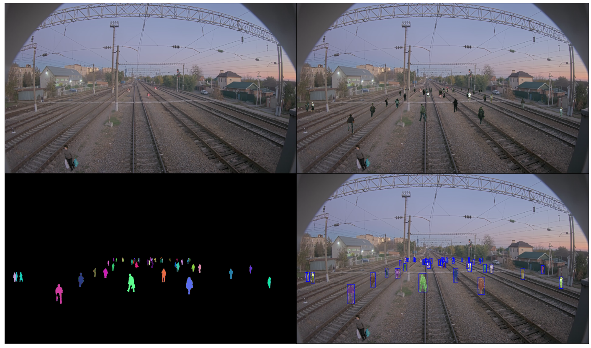

# "Cut and paste" augmentation

[](https://zenodo.org/badge/latestdoi/328174810)

Repository contains easy to use Python implementation of "Cut and paste" augmentation for object detection and instance and semantic segmentations. The main idea was taken from [Simple Copy-Paste is a Strong Data Augmentation Method for Instance Segmentation](https://arxiv.org/pdf/2012.07177v1.pdf) and supplemented by the ability to add objects in 3D in the camera coordinate system using a Bird's Eye View Transformation (BEV). Easy to use with [albumentations](https://github.com/albumentations-team/albumentations)

<figure>
  </img>
</figure>

## Installation

To install all requirements run:

```bash
pip install -r requirements.txt
```

### Requirements

  * Python 3
  * OpenCV
  * numpy

## Example of usage

All examples are shown in [test_generation.ipynb](https://github.com/RocketFlash/CAP_augmentation/blob/main/test_generation.ipynb) 


[](https://colab.research.google.com/drive/1Rmln475YERs5ZIp3_jDKTV8JEfk_qDdy?usp=sharing)

### Usage in pixel coordinates

```python
from src.cap_aug import CAP_AUG
import cv2

SOURCE_IMAGES = ['list/', 'of/', 'paths/', 'to/', 'the/', 'source/', 'image/', 'files']
##### For example a list of paths to images can be set like this #####
# DATASET_ROOT = Path('data/human_dataset_filtered/')
# SOURCE_IMAGES = sorted(list(DATASET_ROOT.glob('*.png')))
######################################################################

image = cv2.imread('path/to/the/destination/image')

cap_aug = CAP_AUG(SOURCE_IMAGES, n_objects_range=[10,20],        
                                        h_range=[100,101],
                                        x_range=[500, 1500],
                                        y_range=[600 ,1000],
                                        coords_format='xyxy') # xyxy, xywh or yolo
result_image, bboxes_coords, semantic_mask, instance_mask = cap_aug(image)
```

### Usage in camera coordinate system (all values are in meters)

When using bev transformation it is necessary to set range values in meters.

```python
from src.cap_aug import CAP_AUG
import cv2

SOURCE_IMAGES = ['list/', 'of/', 'paths/', 'to/', 'the/', 'source/', 'image/', 'files']

image = cv2.imread('path/to/the/destination/image')

# Extrinsic camera parameters
camera_info = {'pitch' : -2 ,
               'yaw' : 0 ,
               'roll' : 0 ,
               'tx' : 0,
               'ty' : 5,
               'tz' : 0,
               'output_w': 1000, # output bev image shape
               'output_h': 1000}
calib_yaml_path=None # path to intrinsic parameters (see example in BEV/camera_intrinsic_params.yaml file)
                     # if calib_yaml_path is None, intrinsic params will be loaded from BEV/camera_intrinsic_params.yaml

bev_transform = BEV(camera_info=camera_info,
                    calib_yaml_path=calib_yaml_path)
                    
cap_aug = CAP_AUG(SOURCE_IMAGES, bev_transform=bev_transform, 
                                               n_objects_range=[30,50], 
                                               h_range=[2.0, 2.5],
                                               x_range=[-25, 25],
                                               y_range=[0 ,100],
                                               z_range=[0 ,2],
                                               coords_format='yolo') # xyxy, xywh or yolo
result_image, bboxes_coords, semantic_mask, instance_mask = cap_aug(image)
```

### Usage with albumentations

```python

from src.cap_aug import CAP_Albu
import albumentations as A

transform = A.Compose([
    CAP_Albu(p=1, 
               source_images=SOURCE_IMAGES, 
               n_objects_range=[10,20], 
               h_range=[100,101],
               x_range=[500, 1500],
               y_range=[600 ,1000],
               class_idx=1),
    A.HorizontalFlip(p=0.5),
    A.RandomBrightnessContrast(p=0.2),
    A.RandomRain(p=1.0, blur_value=3)
], bbox_params=A.BboxParams(format='pascal_voc'))
   
```

### Usage with multiple classes
Example of usage cold be found in [test_generation.ipynb](https://github.com/RocketFlash/CAP_augmentation/blob/main/test_generation.ipynb) 

## Data preparation

Any png images with transparency are suitable for inserting objects for object detection or instance segmentation. It is possible to generate own dataset of png images with transparency by cutting images from various segmentation datasets. An example of preparing such a dataset for insertion is shown below.

### Generate pedestrians dataset from CityScapes and CityPersons

Put [Cityscapes](https://www.cityscapes-dataset.com/) and [CityPersons](https://github.com/cvgroup-njust/CityPersons) datasets in ./data folder. Edit parameters in dataset/config.py if you want and then just run:

```bash
./dataset/cityscapes/generate_and_filter_dataset.sh 
```

This script will create a dataset of png images cutted and filtered in the data/human_dataset_filtered folder or in the folder that you specified in the data/config.py file.

Another option is to run python scripts manually step by step. First, we need to create .png files of people using instance masks from cityscapes dataset:

```bash
python dataset/cityscapes/generate_dataset.py 
```

Next, we need to filter images to remove too small or too cropped (only a small part of the body is visible) images:

```bash
python dataset/cityscapes/filter_dataset.py 
```

Now the dataset for insertion is available in ./data/human_dataset_filtered

## TODO

- [x] Add easy albumentations integration
- [x] Add example of usage on multiple classes
- [x] Add Colab notebook with examples
